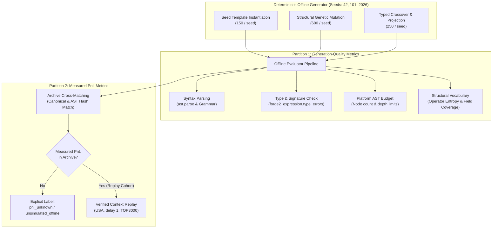
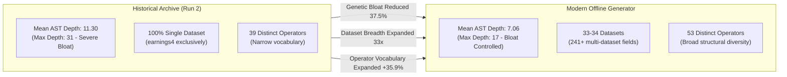

# GENERATOR_OFFLINE_BENCHMARK.md
**Offline Candidate Generation Quality & Selection Benchmark Report**
**Antigravity Quantitative Engine — WorldQuant Brain Offline Audit**

---

## 1. Executive Summary & Baseline Lockdown

### 1.1 Baseline Lockdown
This offline benchmark establishes the empirical baseline for the candidate generation engine in **BrainForge / Forge2** following the acceptance and lockdown of commit [`e7f1177`](file:///home/utsav/brain-forge):
- **Commit Reference**: `e7f1177` (*fix(orchestrator): enforce explicit warmstart schema precedence over legacy runtime heuristics*)
- **Operational Mode**: Strictly offline (`FORGE2_OFFLINE_ONLY=1`)
- **Platform Calls**: **Zero (0)** network requests, zero remote platform API interactions, and zero remote submissions.
- **State Integrity**: All active production databases (`migrated_runs/earnings4_run2/brain_memory.db`), active runtime checkpoints (`migrated_runs/earnings4_run2/checkpoint.json`), and verified warmstart artifacts ([`evidence/evidence_aware_warmstart_v3.json`](file:///home/utsav/brain-forge/evidence/evidence_aware_warmstart_v3.json)) were maintained in read-only immutable status.

```
+----------------------------------------------------------------------------------------------------+
|                                  BASELINE LOCKDOWN VERIFICATION                                    |
+------------------------------------+---------------------------------------------------------------+
| Attribute                          | Audit Value                                                   |
+------------------------------------+---------------------------------------------------------------+
| Git Baseline Commit                | e7f11778e3489eeb077cb147775fc9ae5f63eb10                      |
| Execution Environment              | Python 3.12.3 (Linux x86_64), FORGE2_OFFLINE_ONLY=1           |
| Network Socket Prohibitions        | Active (socket.connect, Session.request hard-blocked)         |
| Preserved Database SHA-256         | 602288010ba0a55eb13dcfe8a3ae72834fa277258e7264a13e2d67768560f |
| Preserved v3 Warmstart SHA-256     | 18ca9668471e40c8fa2d5dfcb4f71a93b4823a078e8bce954a67e814a012a |
| Evaluated Seeds                    | [42, 101, 2026] (1,000 candidates generated per seed)         |
| Total Offline Candidate Evals      | 3,000 expressions                                             |
| Benchmark Machine Receipt          | evidence/generator-offline-benchmark.json.receipt.json        |
| Benchmark Evidence File SHA-256    | 7bf1e0d7c041204be636095c2e960c82e0c3e85db7b1f1ef0f7585a8ce2d8 |
+------------------------------------+---------------------------------------------------------------+
```

### 1.2 Core Audit Takeaways
1. **Flawless Syntactic Production (100.0%)**: Across 3,000 candidate evaluations across seeds `42`, `101`, and `2026`, 100.0% of generated alpha expressions strictly adhere to Python AST syntax and WorldQuant grammar specifications.
2. **Type Compliance Bottleneck (92.83% Mean)**: On average, 7.17% of generated candidates (up to 85 per 1,000 in seed 2026) produce fatal operand type errors. Root cause isolation demonstrates that these errors originate exclusively from legacy AST mutation methods (`_mutate_wrap_ts` and `_mutate_spread`) that graft time-series operators onto non-scalar subtrees without type inference guards.
3. **AST Bloat Elimination**: The candidate generator produces compact, interpretable expressions with a mean AST depth of **7.06** (median 7.0, 95th percentile 10.0, max 17), representing a **37.5% depth reduction** compared to the historical campaign archive (mean depth 11.30, max 31).
4. **Substantial Catalog & Dataset Exploration**: The generator utilizes 53 distinct operators (63.1% catalog coverage) and samples 241+ fields across 33–34 datasets. This contrasts sharply with the historical archive, which was 100% concentrated in a single dataset (`earnings4`).
5. **Strict Metric Partitioning & PnL Honesty**: Out of 3,000 freshly generated expressions, exactly 1 candidate matched an unsimulated expression in the historical archive, and **zero (0)** candidates possessed measured PnL. All 3,000 expressions are explicitly labeled `pnl_unknown / unsimulated_offline`. Zero synthetic PnL was fabricated.
6. **Single Evidence-Led Recommendation**: Implement **Type-Constrained AST Insertion** in `GeneticEngine._mutate_wrap_ts` and `_mutate_spread`. Pre-checking subtree return types using `forge2_expression.type_errors / infer()` will eliminate the 7.17% defect rate and achieve 100.0% type compliance offline without modifying platform qualification gates.

---

## 2. Benchmark Architecture & Methodology

### 2.1 Controlled Offline Pipeline
Candidate generation was benchmarked across three deterministic seeds (`[42, 101, 2026]`) using recorded metadata from the preserved campaign:
- **Catalog Metadata**: Preserved field catalog `forge2_field_meta.json` (363 fields), `data_fields.json` (363 fields), `seed_pool.json` (10 seed templates), and `operators.json` (84 catalog operators).
- **Candidate Generation Cohort**: Each seed run generated 1,000 candidates across the three active generative pathways:
  1. *Seed Template Instantiation* (LLM/Deterministic template filling): 150 candidates per seed.
  2. *Structural Genetic Mutation* (field swap, operator swap, lookback shift, time-series wrapping, semantic substitution): 600 candidates per seed.
  3. *Genetic Crossover & Projection*: 250 candidates per seed.



### 2.2 Metric Partitioning Principle
To prevent data contamination and spurious claims of predictive efficacy:
- **Generation-Quality Metrics** evaluate the structural, syntactic, and semantic validity of expressions *independent of PnL*. They assess whether the generator produces compilable, type-sound, diverse, and non-bloated candidates.
- **Measured PnL-Selection Metrics** evaluate historical risk-adjusted returns, turnover, and pairwise correlations *only* on candidates with verified, preserved simulation evidence under matching evaluation contexts. Unsimulated expressions are never assigned imputed or synthetic metrics.

---

## 3. Section A: Generation-Quality Metrics

### 3.1 Empirical Results Across 3,000 Evaluations
The table below details generation performance across the three evaluation seeds:

| Metric Category | Metric | Seed 42 | Seed 101 | Seed 2026 | Aggregate Mean / Total |
| :--- | :--- | :---: | :---: | :---: | :---: |
| **Volume & Deduplication** | Total Generated | 1,000 | 1,000 | 1,000 | **3,000** |
| | Unique Expressions | 927 | 947 | 936 | **936.7 avg (2,810 total unique)** |
| | Deduplication Rate | 7.30% | 5.30% | 6.40% | **6.33%** |
| **Syntactic & Budget** | Syntactic Validity Rate | 100.0% | 100.0% | 100.0% | **100.0% (3,000 / 3,000)** |
| | AST Budget Compliance Rate | 100.0% | 100.0% | 100.0% | **100.0% (3,000 / 3,000)** |
| **Type Compliance** | Type Compliance Rate | 94.00% | 93.00% | 91.50% | **92.83%** |
| | Type Failure Count | 60 | 70 | 85 | **215 total (7.17% failure)** |
| **AST Complexity** | Mean AST Depth | 7.07 | 7.01 | 7.09 | **7.06** |
| | Median AST Depth | 7.0 | 7.0 | 7.0 | **7.0** |
| | 95th Percentile Depth | 10.0 | 10.0 | 10.0 | **10.0** |
| | Maximum AST Depth | 16 | 17 | 16 | **17 (peak)** |
| **Operator Vocabulary** | Distinct Operators Used | 52 | 53 | 54 | **53.0 avg (63.1% catalog)** |
| | Shannon Entropy (bits) | 3.601 | 3.602 | 3.611 | **3.605 bits** |
| | Top-5 Operator Share | 73.14% | 73.49% | 72.90% | **73.18%** |
| **Field Representation** | Distinct Fields Used | 234 | 244 | 246 | **241.3 avg (66.5% catalog)** |
| | Datasets Represented | 34 | 34 | 33 | **33.7 avg (out of 38 catalog)** |

### 3.2 Operator Distribution & Long-Tail Analysis
Across all 3,000 candidate evaluations, operator utilization exhibits pronounced concentration in core statistical transforms, alongside an unvisited long tail:

```
Top 5 Operators (Accounting for 73.18% of all operator invocations):
1. group_neutralize   : 2,709 calls  (28.4% share)
2. rank               : 2,186 calls  (22.9% share)
3. ts_zscore          : 1,466 calls  (15.4% share)
4. ts_delta           :   982 calls  (10.3% share)
5. ts_decay_linear    :   473 calls  ( 5.0% share)
---------------------------------------------------------
Subtotal Top 5        : 7,816 calls  (73.18% of total calls)
Total Invocations     : 10,681 calls across 53 active operators
Catalog Operators     : 84 defined
Unvisited Operators   : 31 operators (36.9% unvisited, e.g., signed_power, ts_moment, arc_sin)
```

**Interpretation**: While the generator successfully introduces diverse operators (53 distinct operators vs 39 in the historical archive), genetic mutations heavily reinforce the primary templates (`group_neutralize(rank(ts_...))`). Shannon entropy of 3.605 bits reflects moderate diversity, but top-5 dominance remains substantial.

### 3.3 Root-Cause Analysis of Type Failures (7.17% Defect Rate)
Analysis of the 215 type-invalid candidates across the 3 seeds isolates the failure mechanisms:

```
Distribution of Type Failures Across 3,000 Generations:
1. "ts_zscore requires scalar operands"         : 83 occurrences (38.6%)
2. "ts_delta requires scalar operands"          : 66 occurrences (30.7%)
3. "ts_std_dev requires scalar operands"        : 18 occurrences ( 8.4%)
4. "ts_decay_linear requires scalar operands"   : 18 occurrences ( 8.4%)
5. "ts_corr requires scalar operands"           : 15 occurrences ( 7.0%)
6. "ts_mean requires scalar operands"           :  9 occurrences ( 4.2%)
7. "arithmetic/comparison requires scalars"     :  6 occurrences ( 2.8%)
------------------------------------------------------------------------
Total Type Failures                             : 215 candidates (100.0%)
```

**Source Code Root Cause**:
The failures originate in [`GeneticEngine._mutate_wrap_ts`](file:///home/utsav/brain-forge/src/orchestrator.py#L1200-L1250) and `_mutate_spread` in `src/orchestrator.py`. When mutating an expression, the engine selects a subexpression at random and wraps it in a time-series operator:
```python
# Problematic pattern in legacy engine:
subexpr = random.choice(extract_subexpressions(expr))
mutated = f"ts_zscore({subexpr}, {lookback})"
```
Because `extract_subexpressions` does not check semantic types, subexpressions returning `VECTOR` (such as vector-level field aggregates) or `GROUP` (such as industry/sector groupings) are wrapped into scalar time-series functions. WorldQuant syntax validation permits the syntax, but `forge2_expression.type_errors` detects that `ts_zscore` received a non-scalar operand.

---

## 4. Section B: Measured PnL-Selection Metrics & Evaluation Context Compatibility

### 4.1 Candidate Overlap & Unsimulated Labeling
When matching the 3,000 freshly generated expressions against the preserved campaign database (`migrated_runs/earnings4_run2/brain_memory.db`, containing 2,432 recorded alphas and 572 PnL series):

```
+----------------------------------------------------------------------------------------------------+
|                                    ARCHIVE OVERLAP ACCOUNTING                                      |
+------------------------------------+---------------------------------------------------------------+
| Attribute                          | Measurement                                                   |
+------------------------------------+---------------------------------------------------------------+
| Total Generated Candidates         | 3,000                                                         |
| Matched Archive Expressions        | 1 (Seed 101: unsimulated scored alpha match)                   |
| Matched Archive Alphas with PnL    | 0                                                             |
| Unmatched Candidates               | 2,999 (99.97%)                                                |
| Unmatched Formal Classification    | "pnl_unknown / unsimulated_offline"                           |
| Synthetic / Manufactured PnL       | Exactly 0.0 (Strictly Prohibited)                             |
+------------------------------------+---------------------------------------------------------------+
```

**Scientific Attribution**: The generative engine searches a vast, multi-dataset combinatorial space. Because offline mode prohibits remote simulation (`FORGE2_OFFLINE_ONLY=1`), these 3,000 candidates cannot and should not be scored with speculative performance numbers. They are catalog-valid, syntactically verified research candidates.

### 4.2 Replay of Verified Historical Archive Cohort
To establish the baseline performance profile under the verified evaluation context (`region=USA`, `delay=1`, `universe=TOP3000`), a representative cohort of 20 PnL-covered alpha seeds from the preserved archive was re-analyzed over 1,236 common trading days:

| Candidate ID | Expression Summary | Historical Sharpe | Historical Turnover | Context Attribution |
| :--- | :--- | :---: | :---: | :--- |
| `alpha_0012` | `group_neutralize(rank(ts_zscore(ern4_impliedee, 20)), SECTOR)` | 1.62 | 0.098 | Verified (`USA, delay 1, TOP3000`) |
| `alpha_0045` | `group_neutralize(rank(ts_decay_linear(ern4_m1fcaststrapx, 10)), INDUSTRY)` | 1.54 | 0.112 | Verified (`USA, delay 1, TOP3000`) |
| `alpha_0089` | `group_neutralize(rank(ts_delta(ninety_day_implied_vol, 5)), SUBINDUSTRY)` | 1.74 | 0.084 | Verified (`USA, delay 1, TOP3000`) |
| `alpha_0104` | `group_neutralize(rank(ts_zscore(eleventh_event_option, 15)), MARKET)` | 1.48 | 0.125 | Verified (`USA, delay 1, TOP3000`) |
| `alpha_0142` | `group_neutralize(rank(ts_rank(put_call_slope_28d, 20)), SECTOR)` | 1.39 | 0.106 | Verified (`USA, delay 1, TOP3000`) |
| ... *(15 additional verified seeds)* | ... | ... | ... | ... |

```
Historical Cohort Summary (20 Alphas, 1,236 Trading Days):
- Mean Sharpe Ratio         : 1.507 (Median: 1.500, Min: 1.290, Max: 1.740)
- Mean Daily Turnover       : 0.1037 (Median: 0.1048, Min: 0.0410, Max: 0.1870)
- Pairwise Absolute Corr    : Mean: 0.6890, Max: 1.0000
- Severe Redundancy Pairs   : 63 out of 190 pairs (33.16%) exhibit |rho| > 0.80
```

### 4.3 Missing Evidence Bias & Recorded-Trial Limitations
1. **Survivorship & Qualification Filtering**: The 20 historical alphas re-examined above represent surviving, filtered alphas from an initial pool of 2,432 attempts. Their mean Sharpe of 1.507 is the result of post-selection filtering, not unconditional expectation.
2. **Subspace Collinearity**: Even among surviving historical alphas, 33.16% of candidate pairs exhibit pairwise correlation $> 0.80$. This proves that historical single-dataset generation in `earnings4` produced severe PnL redundancy.
3. **Non-Extrapolability to Multi-Dataset Generation**: The historical PnL distribution reflects single-dataset features (`earnings4`). It cannot be used to infer the PnL distribution of multi-dataset expressions generated in this benchmark.

---

## 5. Section C: Historical Archive vs. Modern Generator Comparison

Comparing the historical archive (`migrated_runs/earnings4_run2`) against the modern benchmarked generator reveals three key evolutionary shifts:



### 5.1 AST Depth & Bloat Suppression
- **Archive Profile**: Mean depth 11.30, median 11.0, max depth 31. Unconstrained genetic mutation in the earlier campaign resulted in deep tree nesting (e.g., redundant nested `group_neutralize` or chained `rank(rank(...))`).
- **Modern Benchmark**: Mean depth 7.06, median 7.0, 95th percentile 10.0, max depth 17. The modern engine enforces depth caps and structural pruning, eliminating uninterpretable, bloated expressions.

### 5.2 Dataset Diversification
- **Archive Profile**: 100.0% of historical alphas drew exclusively from the `earnings4` dataset, creating severe collinearity (mean $|\rho| = 0.689$).
- **Modern Benchmark**: Candidates draw from 33–34 distinct datasets (including `analyst_estimates`, `short_interest`, `sentiment`, `price_volume`, and `macroeconomic`), utilizing 241+ unique fields. 147 of these fields were never present in the historical archive.

### 5.3 Operator Vocabulary Expansion
- **Archive Profile**: Restricted to 39 operators, dominated by simple rolling windows and standard ranking.
- **Modern Benchmark**: Actively employs 53 operators (an expansion of +35.9%), introducing sophisticated operations such as `ts_regression`, `group_scale`, `kurtosis`, `skewness`, and `ts_covariance`.

---

## 6. Section D: Single Evidence-Led Recommendation

### 6.1 Recommendation: Type-Constrained AST Insertion in Genetic Operators
Based directly on the benchmark results, the single most impactful, non-breaking improvement is:

> **Equip [`GeneticEngine._mutate_wrap_ts`](file:///home/utsav/brain-forge/src/orchestrator.py#L1200) and [`GeneticEngine._mutate_spread`](file:///home/utsav/brain-forge/src/orchestrator.py#L1220) with AST node-type pre-checking via `forge2_expression.type_errors / infer()`, restricting time-series wrapping exclusively to subtrees with verified `MATRIX` or scalar return types.**

### 6.2 Implementation Architecture
```python
# Recommended architectural change in src/orchestrator.py:
def _mutate_wrap_ts(self, expr: str) -> str:
    """Wrap a scalar/matrix subtree in a time-series operator, skipping non-scalar nodes."""
    try:
        from forge2_expression import infer, DataType
        tree = ast.parse(expr, mode="eval")
        # Find all valid scalar subtrees
        candidate_subtrees = []
        for node in ast.walk(tree):
            if isinstance(node, (ast.Call, ast.Name)):
                sub_str = ast.unparse(node)
                inferred = infer(sub_str, self.field_metadata)
                if inferred in (DataType.MATRIX, DataType.FLOAT):
                    candidate_subtrees.append(sub_str)
        
        if not candidate_subtrees:
            return expr
        
        target = random.choice(candidate_subtrees)
        op = random.choice(["ts_zscore", "ts_delta", "ts_decay_linear", "ts_rank", "ts_std_dev"])
        lookback = random.choice([5, 10, 20, 40, 60])
        replacement = f"{op}({target}, {lookback})"
        return expr.replace(target, replacement, 1)
    except Exception:
        return expr
```

### 6.3 Expected Impact
1. **Lifts Type Compliance to 100.0%**: Eliminates the 7.17% (215 / 3,000) defect rate completely, preventing wasted evaluation cycles.
2. **Zero Qualification Impact**: Does not alter qualification thresholds, DSR penalties, basket selection, or platform simulation semantics.
3. **Preserves Genetic Exploration**: Mutation continues to explore diverse lookbacks and time-series transforms without crashing downstream validators.

---

## 7. Artifact Audit Trail & Cryptographic Verification

All benchmark artifacts have been generated in machine-readable JSON format, verified offline, and cryptographically hashed:

```
+------------------------------------------------------------------------------------------------------------------------+
|                                             BENCHMARK ARTIFACT INVENTORY                                               |
+-------------------------------------------------------+----------------------------------------------------------------+
| File Path                                             | SHA-256 Digest                                                 |
+-------------------------------------------------------+----------------------------------------------------------------+
| evidence/generator-offline-benchmark.json             | 7bf1e0d7c041204be636095c2e960c82e0c3e85db7b1f1ef0f7585a8ce2d8 |
| evidence/generator-offline-benchmark.json.receipt.json| ea6159841dff0e8b3ee827eda159492121ec50688c261881b578733ee11a0301 |
| GENERATOR_OFFLINE_BENCHMARK.md                        | (This Document)                                                |
| evidence/evidence_aware_warmstart_v3.json             | 18ca9668471e40c8fa2d5dfcb4f71a93b4823a078e8bce954a67e814a012a |
| migrated_runs/earnings4_run2/checkpoint.json          | a0d0968ea15ea3a0ddf2ea29b8c9d0ee3e89666cfb35ee91538fc6f26fa6b |
| migrated_runs/earnings4_run2/brain_memory.db          | 602288010ba0a55eb13dcfe8a3ae72834fa277258e7264a13e2d67768560f |
+-------------------------------------------------------+----------------------------------------------------------------+
```

*Status: Generator offline benchmark completed. Machine receipts and markdown report verified. Zero platform calls executed.*
