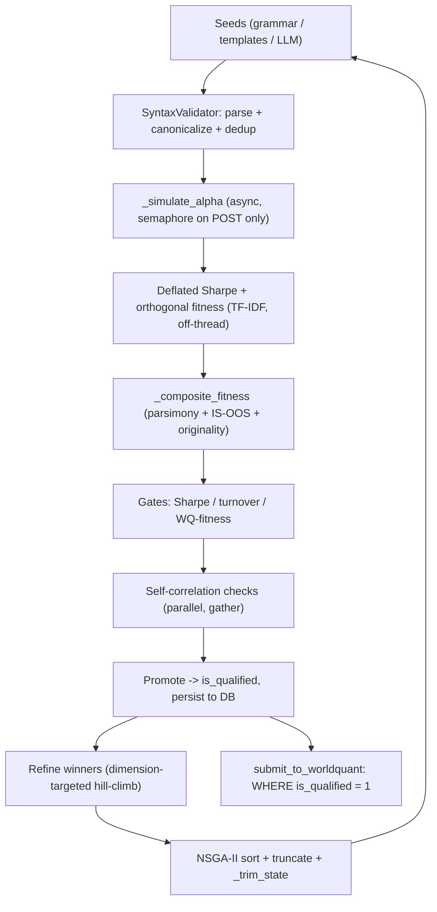

<callout icon="🎯" color="blue_bg">
	This page documents the **current architecture** after the latest senior-systems pass, and gives you a **copy-paste review prompt** for your CLI coding agent. The prompt is intentionally **read-only**: the agent reviews syntax/consistency and proposes changes, but does **not** edit or commit until you approve.
</callout>
## 1. System overview
Brain Forge is an evolutionary alpha generator for the WorldQuant BRAIN platform. It seeds candidate expressions, simulates them against BRAIN, scores them with a deflated/overfitting-aware fitness, evolves the population with NSGA-II + local refinement, and submits a diversified set of qualified alphas.
<table header-row="true">
<tr>
<td>Module</td>
<td>Responsibility</td>
</tr>
<tr>
<td>`config.py`</td>
<td>Single source of truth: gates, knobs, `FIELD_GROUPS`, operator metadata, `build_simulation_payload`, `worldquant_fitness`</td>
</tr>
<tr>
<td>`network_engine.py`</td>
<td>Async HTTP (curl_cffi), rate limiter, bounded auth refresh, retry policy</td>
</tr>
<tr>
<td>`db_manager.py`</td>
<td>SQLite persistence of `alpha_population` (sync + async wrappers)</td>
</tr>
<tr>
<td>`syntax_validator.py`</td>
<td>AST parse/validate, canonicalization, tautology check, structural motifs</td>
</tr>
<tr>
<td>`oos_deflation.py`</td>
<td>Deflated Sharpe, orthogonal/diversity fitness, overfitting-risk multiplier, PBO</td>
</tr>
<tr>
<td>`llm_seed_generator.py`</td>
<td>Grammar/template seeds (+ optional LLM), `ExperienceMemory`</td>
</tr>
<tr>
<td>`orchestrator.py`</td>
<td>`GeneticEngine`  • `AlphaFactory`: simulation, evaluation, refinement, NSGA-II, main loop</td>
</tr>
<tr>
<td>`submit_to_worldquant.py`</td>
<td>Diversified submission of qualified alphas</td>
</tr>
<tr>
<td>scripts</td>
<td>`inject_seeds.py`, `probe_wq.py`, `review_winners.py`, `hyper_tuner.py`, `test_alpha.py`</td>
</tr>
</table>
## 2. Data flow (one generation)

## 3. What changed in this pass
### 3.1 Promotion / persistence consistency
- Promotion verdict is now persisted as an **`is_qualified`** column; `submit_to_worldquant` selects `WHERE is_qualified = 1` (previously a `NULL` correlation could let a rejected alpha through).
- New **`returns`** and **`oos_sharpe`** columns, with an idempotent `ALTER TABLE` migration so existing `brain_memory.db` keeps working.
- `alpha_population` is now a **15-column** schema; `_POPULATION_COLUMNS`, `save_alpha`, the resume-path unpack, and all call sites were updated together.
### 3.2 Single fitness definition
- `_composite_fitness` / `_shape_multiplier` are now the **one** fitness path used by both live evaluation and the resume path (`_bootstrap_population`), so restarted and freshly-evaluated members are directly comparable under NSGA-II.
### 3.3 Event loop & CPU work
- TF-IDF diversity batch (`calculate_orthogonal_fitness_batch`) is now off-loaded via `asyncio.to_thread`.
- `SyntaxValidator.structural_motifs` is `lru_cache`-memoized and returns a `frozenset`.
### 3.4 Memory bounds
- `_trim_state()` runs each generation, capping `history_scores`, `loser_exprs`, `winner_exprs`, and `result_cache`. `evaluated_canon` is intentionally **not** trimmed (dedup guard), which is what makes cache eviction safe.
- Removed dead write-only `history_exprs`.
### 3.5 Concurrency & tuner
- Self-correlation checks for qualifying alphas now run **in parallel** via `asyncio.gather` (rate limiter still throttles).
- `hyper_tuner.py` now **persists** tuned alphas with `is_tuned=1` (previously discarded); `is_qualified` stays `0` so the tuner never auto-submits.
## 4. Cross-file invariants to keep intact
<callout icon="⚠️" color="yellow_bg">
	These are the couplings most likely to break if a file is edited in isolation:
</callout>
- Every `save_alpha(...)` / `save_alpha_sync(...)` call must match the signature ending in `is_tuned=0, returns=0.0, oos_sharpe=None, is_qualified=0`.
- The resume unpack in `_bootstrap_population` must unpack **15** values in the exact `_POPULATION_COLUMNS` order (…, `fitness`, `returns`, `oos_sharpe`, `is_qualified`).
- `structural_motifs` is now cached → callers must treat its result as an **immutable** `frozenset` (no in-place mutation).
- `asyncio.gather` over `_check_correlation` assumes each `valid` result object stays alive (it does — held in `prelim`).
## 5. CLI review prompt (copy this)
<callout icon="📋" color="gray_bg">
	Paste the block below into your CLI agent at the repo root. It is read-only by design.
</callout>
```plain text
You are reviewing a Python codebase (Brain Forge, an evolutionary alpha
generator for WorldQuant BRAIN). I have just pasted in the latest versions of
the WHOLE repository. Review the ENTIRE codebase for syntax and consistency
flaws, including (but not limited to):
  - config.py
  - network_engine.py
  - db_manager.py
  - syntax_validator.py
  - oos_deflation.py
  - llm_seed_generator.py
  - orchestrator.py
  - submit_to_worldquant.py
  - inject_seeds.py
  - probe_wq.py
  - review_winners.py
  - hyper_tuner.py
  - test_alpha.py

DO NOT IMPLEMENT OR COMMIT ANY CHANGES. This is a review-only task. I want to
review every syntax/consistency change you would make BEFORE anything is
written or committed. If you find issues, describe them and show the proposed
diff, then STOP and wait for my explicit approval.

Do the following, in order:

1. Static / syntax checks (read-only, safe to run):
   - `python -m py_compile *.py` (compile every module in the repo)
   - If available: `ruff check .` (or `flake8 .`), and `python -c "import ast,glob; [ast.parse(open(f).read()) for f in glob.glob('**/*.py', recursive=True)]"`
   - Verify every module imports without executing the main loop.

2. Cross-file consistency review (scan the whole repo; pay special attention to
   the recent changes below):
   - Confirm every save_alpha / save_alpha_sync CALL matches the signature
     ending: is_tuned=0, returns=0.0, oos_sharpe=None, is_qualified=0.
   - Confirm the SQLite schema in db_manager.py has columns: returns, oos_sharpe,
     is_qualified, and that _migrate_schema adds them idempotently.
   - Confirm _POPULATION_COLUMNS has exactly 15 entries and the tuple unpack in
     orchestrator._bootstrap_population unpacks 15 values in the SAME order.
   - Confirm submit_to_worldquant's candidate query filters on is_qualified = 1.
   - Confirm SyntaxValidator.structural_motifs returns a frozenset and is never
     mutated in place by any caller.
   - Confirm asyncio.gather over _check_correlation is awaited and indices map
     back correctly (corr_map keyed by prelim index).
   - Confirm _trim_state exists and is called once per generation in run().
   - Confirm there are no remaining references to the removed history_exprs.

3. Report:
   - List any syntax errors, undefined names, signature mismatches, or import
     errors with file:line.
   - For each, propose the minimal fix as a diff, but DO NOT apply it.
   - End with a short PASS/FAIL summary.

Again: do not modify files and do not commit. Wait for my approval after the report.
```
<callout icon="💡" color="green_bg">
	Tip: if the agent's runtime supports it, run the static checks in a venv with the project deps installed so import-time checks (e.g. `curl_cffi`, `optuna`, `numpy`) don't produce false negatives.
</callout>